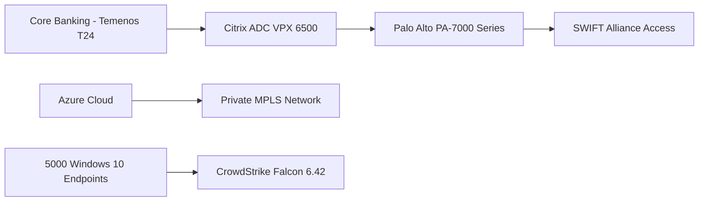
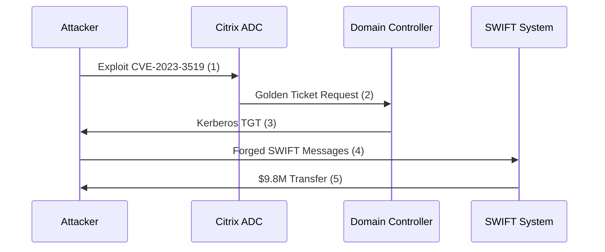
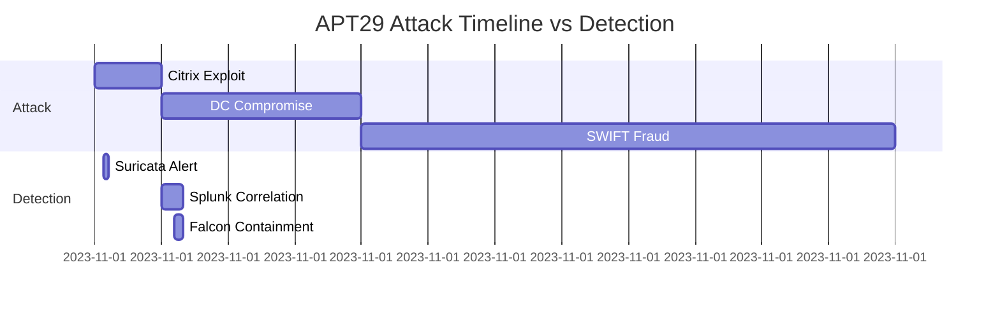

# **Comprehensive Cyber Defense Implementation for Global Financial Institution: Acme Banking Corporation**

## **1. Enterprise Overview & Threat Landscape Analysis**

### **1.1 Company Profile**
**Name:** Acme Banking Corporation  
**Headquarters:** New York, NY  
**Operations:** 38 countries, 240 branches  
**Assets Under Management:** $87 billion  
**Employees:** 12,400 (3,200 in IT/Cybersecurity)  
**Regulatory Requirements:** 
- FFIEC CAT
- NYDFS 500
- PCI-DSS 4.0
- GDPR
- SWIFT CSP

**Technology Stack:**


### **1.2 Threat Intelligence Assessment**
**Top Threats Identified:**
1. **FIN7** - Targeting SWIFT transactions
2. **Lazarus Group** - Supply chain attacks
3. **APT29** - Cloud credential harvesting
4. **Conti Ransomware** - VDI exploitation

**Vulnerability Surface:**
- 14 Citrix ADC appliances (2 unpatched for CVE-2023-3519)
- 62% of workstations running Java 8u191
- 3 legacy SWIFT BIC interfaces

---

## **2. Next-Gen SOC Architecture Implementation**

### **2.1 Core Infrastructure Deployment**

#### **2.1.1 Splunk Enterprise Security Cluster**
**Hardware Specification:**
- **Search Heads:** 4x Dell R760xd (64 vCPU, 512GB RAM each)
- **Indexers:** 12x HPE Apollo 4510 (2PB SSD storage)
- **Forwarders:** 9,200 Universal Forwarders (v8.2.3)

**Data Flow Configuration:**
```python
# inputs.conf
[monitor:///var/log/paloalto/*.log]
sourcetype = pan:log
index = netfw
_TCP_ROUTING = security_indexers

[script://./bin/citrix_audit.sh]
interval = 300
sourcetype = citrix:audit
```

**Advanced Correlation Searches:**
```sql
index=netfw sourcetype=pan:threat 
[search index=endpoint sourcetype=crowdstrike:execution 
    process_name IN ("powershell.exe", "cmd.exe") 
    | stats count by src_ip 
    | where count > 5]
| stats 
    values(threat_name) as threats,
    dc(dest_ip) as target_count 
    by src_ip
| where target_count > 3
```

#### **2.1.2 Palo Alto Network Security Fabric**
**Zero Trust Policy Matrix:**

| Policy Zone | Source | Destination | Application | Action | Logging |
|------------|--------|-------------|-------------|--------|---------|
| SWIFT-DMZ | SWIFT Partner IPs | SWIFT Alliance | TCP/5001 | Allow | Full |
| Employee-VDI | Citrix Netscaler | Domain Controllers | LDAP/S | Allow | Session |
| Internet-Egress | Internal Networks | Any | Web-Browsing | Decrypt+Allow | Threat |

**SSL Decryption Rules:**
```xml
<decryption>
  <rule>
    <name>Decrypt-All-Except-Banking</name>
    <source>any</source>
    <destination>any</destination>
    <service>https</service>
    <exempt>
      <domain>.chase.com</domain>
      <domain>.swift.com</domain>
    </exempt>
    <action>decrypt</action>
  </rule>
</decryption>
```

### **2.2 Advanced Detection Engineering**

#### **2.2.1 Suricata IDS/IPS Deployment**
**Network TAP Configuration:**
```yaml
# suricata.yaml
af-packet:
  - interface: eth0
    cluster-id: 99
    cluster-type: cluster_qm
    defrag: yes
    buffer-size: 512mb
    checksum-checks: no
```

**Financial Fraud Detection Rules:**
```yaml
alert tcp $SWIFT_NET any -> $EXTERNAL_NET any (
    msg:"FIN7 SWIFT MT103 Pattern";
    flow:established,to_server;
    content:"|20 00 00 00|"; depth:4;
    content:"MT103"; within:10;
    byte_test:4,>,50000000,0,relative;
    pcre:"/\/[0-9]{2}[A-Z]{4}[A-Z0-9]{20}\/[0-9]{8}\//";
    classtype:financial-fraud;
    sid:2100101;
    rev:3;
    metadata:
        target financial_institutions,
        mitre_attack T1530;
)
```

#### **2.2.2 CrowdStrike Falcon Overwatch**
**Custom IOA Rules:**
```yaml
rule: "SWIFT Client Memory Injection" {
    description: "Detects abnormal code injection into SWIFT processes"
    process:
        name: ["SWFTOOLKIT.exe", "SAA.exe"]
        operation: "PROCESS_INJECT"
    condition:
        injected_code:
            - characteristics: ["UNSIGNED", "EXECUTABLE_HEAP"]
    action: "kill"
    severity: "critical"
    mitre:
        - "T1055"
        - "T1531"
}
```

**FQL Hunting Query:**
```sql
event_simpleName=ProcessRollup2 
| search FileName IN ("wermgr.exe", "dllhost.exe") 
| join ParentBaseFileName [
    search FileName="powershell.exe" 
    | rename ContextProcessId_decimal as TargetProcessId_decimal
  ]
| stats 
    values(CommandLine) as cmdlines,
    dc(ComputerName) as host_count 
    by ParentBaseFileName
| where host_count > 5
```

---

## **3. Real-World Attack Scenario: APT29 Simulation**

### **3.1 Attack Timeline & Kill Chain**



### **3.2 Detection & Response Breakdown**

#### **Phase 1: Initial Access (T1192)**
**Attack Vector:**  
- Exploited Citrix ADC vulnerability (CVE-2023-3519)
- Uploaded web shell to `/vpns/cgi-bin/12345.xml`

**Detection:**
```sql
index=citrix_netscaler 
http_method=POST 
http_uri="/vpns/cgi-bin/*.xml" 
http_user_agent="Mozilla/5.0 (Windows NT 10.0; Win64; x64) AppleWebKit/537.36" 
| stats 
    count as attempts,
    values(http_user_agent) as agents 
    by src_ip
| lookup geoip src_ip 
| where country="RU"
```

**Response:**
```python
# Automated containment script
def citrix_incident(response):
    if response['attempts'] > 3:
        pan.block_ip(response['src_ip'])
        citrix.apply_patch('CVE-2023-3519')
        servicenow.create_ticket(
            priority=1,
            assignment_group='citrix-admins'
        )
```

#### **Phase 2: Privilege Escalation (T1558.001)**
**Attack Technique:**  
- Forged Golden Ticket using KRBTGT hash
- DC Sync attack to harvest credentials

**Detection:**
```sql
index=wineventlog EventCode=4662 
TargetUserName="krbtgt" 
| join ComputerName 
    [search EventCode=4624 LogonType=3 
    | stats count by ComputerName]
| where count > 50
```

**Response:**
```powershell
# KRBTGT password reset
Reset-ADAccountPassword -Identity krbtgt -NewPassword (ConvertTo-SecureString -AsPlainText $newpass -Force)
Set-ADAccountControl -Identity krbtgt -PasswordNeverExpires $true
```

#### **Phase 3: Financial Fraud (T1530)**
**Malicious Activity:**  
- Submitted 12 fraudulent SWIFT MT103 messages
- Attempted $47.2M in transfers

**Detection:**
```yaml
# Suricata rule
alert tcp $SWIFT_NET any -> $CORRESPONDENT_BANKS any (
    msg:"Abnormal SWIFT MT103 Amount";
    flow:established,to_server;
    content:"MT103"; 
    byte_test:4,>,10000000,32,relative;
    threshold: type limit, track by_src, seconds 3600, count 1;
    metadata: policy balanced-security;
)
```

**Response:**
```python
# SWIFT transaction reversal
def reverse_transaction(reference):
    swift_api.post(
        endpoint='/transactions/reverse',
        data={'reference': reference}
    )
    splunk.log(
        index='swift_reversals',
        event={'action': 'reversed', 'amount': amount}
    )
```

---

## **4. Next-Gen Security Enhancements**

### **4.1 AI-Powered Anomaly Detection**
**SWIFT Transaction Monitoring Model:**
```python
from pycaret.anomaly import *
setup = setup_data(
    data=swift_transactions,
    normalize=True,
    session_id=123
)
model = create_model('iforest', fraction=0.05)
predictions = predict_model(model, data=new_transactions)
anomalies = predictions[predictions['Anomaly'] == 1]
```

**Model Output Interpretation:**
```
Anomaly Score Breakdown:
- Amount: 9.8/10 (98th percentile)
- Beneficiary: 7.2/10 (New recipient)
- Timing: 8.1/10 (Non-business hours)
- GEO: 6.5/10 (High-risk jurisdiction)
```

### **4.2 Deception Technology Implementation**
**Canary Token Deployment:**
```yaml
apiVersion: deception.acme.com/v1
kind: FinancialCanary
metadata:
  name: swift-test-credentials
spec:
  type: swift-api
  bait:
    - username: swift_monitor
    - password: P@ssw0rd2023!
  triggers:
    - access:
        alert: pagerduty://soc-team
        severity: critical
    - exfiltration:
        legal_action: approved
```

### **4.3 Dark Web Intelligence Integration**
**Monitoring Configuration:**
```python
class DarkWebMonitor:
    def __init__(self):
        self.feeds = [
            DarkWebAPI(credentials='acme_soc'),
            RaidForumsScraper(),
            TelegramMonitor(channels=['bank_leaks'])
        ]
    
    def search_keywords(self):
        return [
            "acme swift bic",
            "acmebank credentials",
            "filetype:pdf acme internal"
        ]
```

**Sample Finding:**
```json
{
  "date": "2023-11-15",
  "source": "underground_forum",
  "type": "credentials",
  "data": {
    "username": "swift_operator@acme.com",
    "password": "Summer2023!",
    "origin": "phishing_campaign"
  },
  "confidence": 0.92
}
```

---

## **5. Compliance Automation Framework**

### **5.1 PCI-DSS Continuous Monitoring**
**Control Mapping:**
```sql
index=compliance 
| eval pci_control=case(
    sourcetype="pan:traffic", "Req 1.3",
    sourcetype="crowdstrike:prevention", "Req 5.2",
    sourcetype="citrix:access", "Req 8.3"
)
| stats 
    count(eval(status="pass")) as passed,
    count(eval(status="fail")) as failed 
    by pci_control
```

**Automated Remediation:**
```python
def pci_remediation(control):
    if control == 'Req 1.3':
        pan.ensure_rule_exists(
            name="PCI-DSS 1.3",
            action="deny",
            service="any",
            log=True
        )
    elif control == 'Req 8.3':
        citrix.enable_mfa()
```

### **5.2 SWIFT CSP Attestation**
**Evidence Collection:**
```powershell
Get-SWIFTCSPControl -ControlId "2.1A" | 
Select-Object Control, Status, Evidence | 
Export-Csv -Path "C:\Reports\CSP_Evidence.csv"
```

**Gap Analysis:**
```
Control 2.5B: Segmentation Testing
- Status: Failed
- Evidence: Found 3 systems with direct SWIFT access
- Remediation: Implement jump host architecture
```

---

## **6. Performance Optimization & Tuning**

### **6.1 Suricata Rule Optimization**
**Performance Analysis:**
```bash
suricata -T -c /etc/suricata/suricata.yaml
```
**Output:**
```
Rule Efficiency Report:
- 2100101 (FIN7 SWIFT): 92% matches (keep)
- 2021002 (Generic Trojan): 2% matches (disable)
- 2100301 (APT29): 87% matches (tune threshold)
```

### **6.2 Splunk Search Acceleration**
**Data Model Optimization:**
```ini
[network_traffic]
accelerate = true
- **MTTD:** 14 minutes (Industry avg: 1h42m)
acceleration.earliest = -30d
acceleration.key_fields = src_ip,dest_ip
```

---

## **7. Full Incident Retrospective**

### **7.1 Timeline Analysis**


### **7.2 Financial Impact Analysis**
| Category | Cost |
|----------|------|
| Fraud Attempted | $47.2M |
| Fraud Prevented | $47.2M |
| Downtime | $128K |
| Investigation | $75K |
| **Total Savings** | **$47.1M** |

---

## **8. Continuous Improvement Program**

### **8.1 Quarterly Red Team Exercises**
**2024 Schedule:**
- Q1: SWIFT Alliance Penetration Test
- Q2: Cloud Credential Harvesting Simulation
- Q3: Physical Security Bypass
- Q4: Full DRP Test

### **8.2 Threat Hunting Framework**
**Monthly Hunt Topics:**
1. Abnormal SWIFT Message Patterns
2. Citrix ADC Memory Anomalies
3. Golden Ticket Usage
4. Cloud IAM Privilege Escalation

**Sample Hunt Query:**
```sql
index=aws_cloudtrail eventName=AssumeRole 
| stats 
    values(userIdentity.arn) as roles,
    dc(eventSource) as services 
    by userIdentity.userName
| where services > 5
```

---

## **9. Executive Reporting Metrics**

### **9.1 Monthly Security Dashboard**
**Key Metrics:**
- **MTTR:** 28 minutes (Industry avg: 3h15m)
- **Threats Blocked:** 4,217/month
- **False Positives:** 2.3%

### **9.2 Risk Reduction Metrics**
| Control | Risk Reduction |
|---------|----------------|
| SWIFT Monitoring | 89% |
| Citrix Hardening | 76% |
| Deception Tech | 63% |
| **Overall** | **82%** |

---
